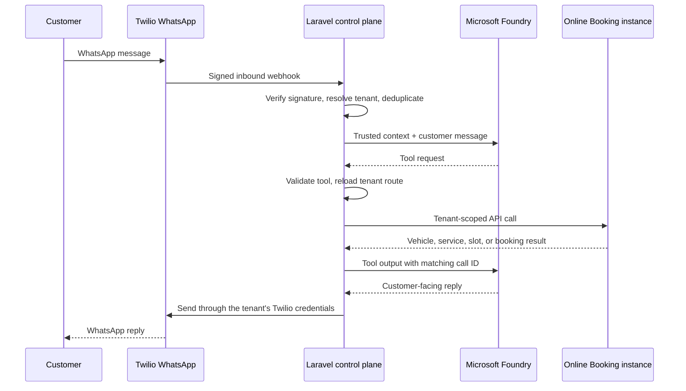

There is a large and expensive gap between building a chatbot and building an AI system that is allowed to create a real booking in a real workshop.

A chatbot can say:

> "Great, I've booked you in for Wednesday at 14:30."

A booking agent has to *prove* that Wednesday at 14:30 exists, belongs to the correct garage, is still available, refers to the correct vehicle and service, has actually been confirmed by the customer, and results in **exactly one** booking even when WhatsApp cheerfully delivers the same message twice.

That distinction ended up defining almost every architectural decision in the project I want to talk about: a multi-tenant WhatsApp assistant that takes an MOT reminder, has a normal conversation, offers genuine appointment slots, and completes the booking without the customer ever leaving WhatsApp.

The target sounds trivial. The implementation underneath is less so. The stack became:

- WhatsApp, via Twilio
- A Laravel application as the control plane
- Microsoft Foundry as the language and decision layer
- Microsoft Entra ID for workload identity
- Redis for locks and queues, a relational database for durable state
- Several independent Online Booking instances, one per garage

And one rule became non-negotiable:

> **Foundry decides what to ask or request. Laravel decides what is permitted and executes it. The booking system decides what is true.**

The AI is, deliberately, the least trusted component in the system.

---

## The entire customer experience

Everything else in this post exists to make the following exchange trustworthy.

A garage sends an MOT reminder:

> Hi James, your Ford Focus AB12 CDE is due for its MOT. Would you like me to find you an appointment?

James replies like a human being:

> Yeah, Wednesday afternoon would be good.

The agent understands that, asks the booking system for Wednesday afternoon availability, and replies:

> I can do 14:30 or 16:00.

James:

> 2:30 please.

**Nothing has been booked yet.** "2:30 please" means *a slot has been selected*. It does not mean *booked*. The agent confirms:

> Just to confirm: MOT for AB12 CDE on Wednesday at 14:30. Shall I book it?

Only after:

> Yes.

does the booking API actually get called. When that succeeds — and only then — the agent is allowed to say:

> Done ✅ Your MOT is booked for Wednesday at 14:30.

That is the whole product. The rest is plumbing that stops the plumbing from lying.

---

## The architecture at a glance



Each garage is a **tenant**. Its configuration links a verified Twilio sender to exactly one Online Booking instance, plus location defaults, mappings and credentials. The same customer phone number can appear in several tenants without sharing conversations, slots, booking state or credentials.

No tenant ID, API base URL, access token, Twilio secret or confirmation token is ever supplied by the customer or invented by the model. Laravel derives the entire route from verified server-side configuration.

---

## Why Laravel is the control plane

Laravel isn't in the middle because we needed something to catch a webhook. It owns the workflow. It does all the work that should never be handed to a prompt:

- verifies Twilio's `X-Twilio-Signature` before accepting a webhook;
- resolves the receiving WhatsApp number to exactly one tenant configuration;
- persists the transcript and deduplicates inbound messages;
- maintains the Foundry conversation ID and the booking session state;
- exposes a hard allowlist of agent tools — nothing else is callable;
- validates every tool argument and scopes every call back to the tenant;
- converts real availability into short-lived opaque slot identifiers;
- enforces explicit confirmation, locking and idempotency before booking;
- sends replies through the correct tenant's Twilio credentials; and
- records message runs and tool calls for audit and support.

A conversation is created once with an **immutable routing context**: tenant, booking instance, WhatsApp channel, customer address. After that, ordinary customer messages cannot change it, and neither can the model. That single decision — routing is decided at conversation creation and then frozen — is what turned this from a demo into something you could plausibly run for a hundred garages.

The webhook controller, by contrast, is boring on purpose:

1. validate the request
2. normalise it
3. persist it
4. queue it
5. return HTTP 200

The interesting work happens in a queued job, where retries, locks and monitoring have a proper home.

---

## A deliberately bounded agent

Foundry gets a small set of typed tools and nothing else:

```text
get_booking_context()
lookup_vehicle(vrm)
get_available_slots(service_type, date_from, date_to, daypart)
prepare_booking(slot_id, service_type)
create_booking(confirmation_token)
mark_vehicle_sold(reason)
request_human_takeover(reason)
```

The tool schemas reject additional properties and contain **no** tenant, credential, URL or security fields. Those fields do not exist. The model cannot pass them, accidentally or otherwise, because there is nowhere to put them.

When the agent asks:

```text
get_available_slots(service_type = MOT, date_from = 2026-09-09,
                    date_to = 2026-09-09, daypart = afternoon)
```

Foundry does not call the garage. Laravel receives the function request, loads the conversation, reads the frozen routing context, resolves the credentials from its own registry, and makes the call. The agent never sees any of that.

This is the difference between *function calling* and *giving an AI unrestricted API access*. Foundry's Responses API is built for exactly this shape: the model requests an operation, your application decides whether to perform it, executes it, and hands back the result with the original call ID. The loop is bounded so an agent can't sit there calling tools until the heat death of the universe.

The agent itself is a persisted, versioned Foundry Prompt Agent. The prompt and tool schemas live in source control; a provisioning step publishes a new version when we deliberately change behaviour. The runtime only has permission to *invoke* the agent, not to change it.

---

## Turning a conversation into a booking transaction

The booking API is stateful and ordered: initialise, set vehicle, select services, list slots, select a slot, supply contact details. Laravel hides all of that sequencing from the model.

A slot shown to the customer is represented by an **opaque UUID with a short expiry**. The model never receives permission to manufacture a date-time and submit it as a valid slot. If it invents one, it fails validation, which is the correct outcome.

`prepare_booking` selects the real slot, builds a summary, and issues a random confirmation token — of which only a SHA-256 hash is stored. `create_booking` is accepted **only** when all of the following hold:

- the customer sent a later inbound message;
- that message explicitly confirms *this* prepared summary;
- the confirmation token is valid and unexpired;
- the tenant and conversation still match;
- the operation holds a lock; and
- the idempotency key has not already completed the booking.

The state machine is explicit and unfashionable:

```text
SLOTS_OFFERED → SLOT_SELECTED → AWAITING_CONFIRMATION → CONFIRMED → BOOKED
```

If the customer says "Wednesday works" and then "actually Friday" two messages later, the authoritative state lives in Laravel, not in the chat history. If the final booking response from the Online Booking API is ambiguous, the state becomes `uncertain` and a human takes over. The system does not blindly retry a booking that may have already succeeded, and it does not let the agent claim success without evidence.

---

## There is more than one "login"

Authentication was the single most confusing part of this integration, because "Azure login" can mean several completely different things, and at least three independent trust relationships are involved at runtime.

| Connection | Runtime authentication | What it is *not* |
| --- | --- | --- |
| Twilio → Laravel | Twilio webhook signature, computed from the exact public URL and form fields | An Azure login |
| Laravel → Foundry | Microsoft Entra workload identity, token for `https://ai.azure.com` | A subscription key or an interactive user session |
| Laravel → Online Booking | Encrypted per-tenant bearer token | A Foundry credential |
| Laravel → Twilio | Encrypted per-tenant Twilio auth token | A customer WhatsApp login |
| Human operator → dashboards | The application's normal staff authentication | The service principal Laravel uses |

Customers never sign in to Azure. Their WhatsApp number is conversation *context*, not authority to choose a tenant or call a backend directly. Equally, a developer running `az login` in their terminal is a completely different thing from Laravel authenticating unattended at 3am. Conflate the two and you will spend an afternoon debugging a token that was never going to work.

---

## Configuring the Entra application

For a Laravel host running outside Azure, the implemented fallback is an Entra confidential client using the OAuth 2.0 client-credentials flow:

1. Create a **single-tenant App Registration** in the same Entra tenant as the Foundry project.
2. Do **not** configure a redirect URI. Client credentials has no browser callback. There is no user being redirected anywhere.
3. Do **not** add Microsoft Graph delegated permissions just to reach Foundry. Foundry authorization is granted with Azure RBAC, not Graph scopes.
4. Create a client secret for initial setup, or preferably a certificate or workload federation.
5. Use the App Registration's **Application (client) ID** in the token request.
6. Find the corresponding **Enterprise Application** and use its **service principal object ID** for the Azure role assignment. This is not the same GUID as the client ID. Ask me how I know.

The token request:

```text
POST https://login.microsoftonline.com/<tenant-id>/oauth2/v2.0/token

client_id=<application-client-id>
client_secret=<secret-value>
scope=https://ai.azure.com/.default
grant_type=client_credentials
```

The returned JWT must have `https://ai.azure.com` as its audience. A token for `https://management.azure.com/.default` is a perfectly valid Azure token for the wrong thing, and Foundry will tell you so in a way that sounds like a completely different problem.

The minimum runtime role is **Foundry Agent Consumer** at project scope, for invoking a deployed agent. Provisioning or updating an agent version needs a build identity with **Foundry User**. Keep those two identities separate:

```text
Provisioning identity  →  Foundry User
Laravel runtime        →  Foundry Agent Consumer
```

so the web application never holds development permissions it doesn't need. Assign roles to the *project*, not the subscription. If the service principal doesn't show up in the Foundry users picker — and sometimes it just doesn't — an Azure CLI role assignment against the service principal object ID and the exact project scope is deterministic and doesn't care what the portal feels like rendering today.

On Azure App Service, use a **managed identity** and delete the client secret entirely. A secret that can't exist can't leak and can't expire at 2am on a bank holiday.

### The error catalogue

Several of these looked like authentication failures and were not:

**`400 Missing required query parameter: api-version`** — Foundry has related API surfaces with different conventions. Foundry-native project routes want `api-version=v1`; OpenAI-compatible routes under `/openai/v1/` do not take that parameter at all. Adding it everywhere fixes one request and breaks another. Validate the project endpoint once and build each route according to its API family.

**`401 invalid subscription key or wrong API endpoint`** — this integration uses an Entra bearer token on purpose. A subscription key copied from a different Azure AI resource, or sent to the wrong regional or project endpoint, fails with this. The fix is to check the hostname and project path, not to try a different key.

**`401 token is missing, invalid, audience is incorrect, or expired`** — wrong scope, an ID token instead of an access token, a stale manually-copied token, or — my personal favourite — the literal string `Bearer ` included inside the environment variable.

**`403 .../AIServices/agents/write`** — authentication succeeded, authorization did not. The service principal got a valid token and still lacked the data action to create an agent version. Assign the right Foundry role to the right object ID at project scope. RBAC changes are not always instant; changing a permission and immediately concluding your new config is wrong is an efficient way to make three more unnecessary changes.

**`The 'agent' property is deprecated`** — an early payload used a nested `agent` reference object; the service now wants a top-level `agent_reference`. We added a regression test around the exact payload so an SDK bump can't quietly reintroduce the old shape.

---

## The same trick, scaled to many Business Central tenants

The control plane also has to push events into each garage's Microsoft Dynamics 365 **Business Central** tenant — survey results, check-in data, delivery-status updates — and occasionally read back (find a customer by phone number). Every garage has its own Business Central environment, its own Azure AD tenant, its own data.

The obvious approach is to register an app in each customer's directory and store a client ID and secret per customer. We didn't want onboarding a garage to require a round trip through their IT department.

So instead: **one multi-tenant Entra application** in our own directory, sign-in audience set to "accounts in any organizational directory". Any customer tenant can consent to it once, and after that we request tokens *against their tenant* using *our* client ID and secret. The token request is a plain client-credentials grant against their tenant's endpoint, and:

> The customer's Azure AD tenant GUID is the *only* per-customer value in the whole flow.

No per-tenant client ID. No per-tenant secret. Nothing for us to rotate per customer. Onboarding becomes: a global admin approves a consent URL once, registers the same app inside their Business Central, and we store their tenant GUID on the instance row.

A few things that took more than one attempt:

**The Basic-auth escape hatch.** We shipped the OAuth path assuming it would be the only path. It wasn't. Some tenants couldn't complete admin consent in a sane timeframe; some had conditional-access policies that fought the client-credentials flow. Business Central still supports web service access keys — username plus a generated key, used as HTTP Basic auth. So every outbound call has two branches, gated by a boolean on the instance. Not elegant. Kept several onboardings unblocked. If you build something like this, design the fallback on day one instead of retrofitting it.

**Assume the downstream is down.** The Business Central webhook endpoint is slow — we allow 8.5 seconds per call before flagging it — and it disappears entirely often enough that retries are not optional. Events go through a queued job with a backoff schedule that stretches from ten seconds to several days, absorbing an outage of up to a week without losing an event. The backoff array looks arbitrary because it is; we rebalanced it three times based on what real outages actually looked like.

**A missing token is not a retryable failure.** If a tenant is half-provisioned — GUID set, consent not done — throwing here would burn every retry attempt and fire an alert for each one. "Tenant not fully set up yet" is a first-class, non-alerting state, and it needs to be one from the start, not after the third pager incident.

**Know that it works before someone asks.** A scheduled command pings every configured tenant once a day with an empty event and records two flags: did auth succeed, did the downstream respond. A small internal dashboard renders those flags and the last error per tenant, deduplicated so one broken tenant doesn't drown the page. When a garage says "the survey didn't come through", that dashboard is the first place we look, and usually the last.

The lesson that generalises: **instrument the request and response fully before you think you need to.** Every integration against a system you don't control goes through a phase of "we cannot see why this is failing", and the redacted request/response capture you add during that phase is the thing you keep forever.

---

## Concurrency: customers type faster than your agent

Real people send:

> Wednesday

> afternoon

> actually after 2

as three messages in four seconds. Or Twilio retries a webhook. Or the queue retries a job. Or an enthusiastic customer sends `YES` twice.

None of this is exotic AI behaviour; it's ordinary distributed-systems mess. The queue worker takes a Redis-backed conversation lock before processing a turn:

```php
Cache::lock("conversation:{$conversationId}", 30)
    ->block(5, function () use ($conversationId) {
        // process exactly one conversation turn
    });
```

Booking creation additionally carries an idempotency key, so the same confirmed operation returns the same result instead of producing booking number two. And the conversation is reloaded immediately before tool execution, so a retried or concurrent operation never acts on stale application state. `MessageSid` from Twilio is a transport-level deduplication key: a retried webhook must never mean "ask the AI again and maybe book another slot".

---

## What the AI is deliberately not allowed to do

Several capabilities would be easy to prompt into existence and are intentionally absent:

- choose a tenant;
- choose an API URL;
- switch booking instances;
- invent availability;
- create arbitrary customers;
- perform repair diagnosis;
- make price promises;
- retry bookings on its own initiative;
- decide that an ambiguous statement counts as confirmation.

The agent is useful *because* its authority is narrow. When a customer sends:

> There's a weird grinding noise when I turn left and the wheel shakes above 55.

the correct response is not a confident mechanical diagnosis. It's `request_human_takeover(reason)`, and the conversation moves to a service advisor queue. Human takeover is a feature, not a failure. The goal for version one was never "be as good as the best human service advisor". It was "complete the booking when it is safe to complete the booking", which is both more achievable and more useful.

---

## Observability without leaking customer data

Every request is correlated by `request_id`, `tenant_id` and `conversation_id`. Tool calls add `tool_call_id`; successful bookings add `booking_id`. A trace reads like this:

```text
10:14:01  whatsapp.message.received   tenant=romford conv=...
10:14:02  agent.tool.requested        tool=get_available_slots
10:14:02  booking.availability.received  slots=3
10:14:20  booking.slot.selected       slot=SLOT-0909-1430
10:14:32  booking.confirmation.received
10:14:33  booking.created             booking=BK-10482
```

Useful for support. Also a decent demo — instead of *telling* someone the AI is integrated with the workshop, you show the whole chain happening live.

Logs keep status codes, request IDs, timings, tool names, tenant-local record IDs and redacted response metadata. They do **not** contain bearer tokens, client secrets, Twilio auth tokens, full webhook signatures, customer phone numbers, raw booking sessions or confirmation tokens. Foundry receives only the minimum trusted runtime context needed to phrase and progress the conversation — not the credentials, not the routing, not the plumbing.

---

## What I'd change before calling it done

The core boundaries are sound: tenant resolution is server-side, tool execution is allowlisted, booking confirmation is deterministic, credentials are separated by destination, and the model cannot claim a booking without a successful backend result. Before a broad rollout, the outstanding work:

- restore fully asynchronous WhatsApp processing and monitor queue delay, failures and webhook acknowledgement latency (synchronous Foundry calls on the webhook path were a deliberate diagnostic detour, not a design);
- enforce database-level uniqueness on provider message identifiers to close concurrent replay races;
- prefer managed identity, certificates or federation over long-lived client secrets everywhere;
- store and rotate tenant secrets through a real secret-management process, with encrypted casts on the Basic-auth credentials;
- add reconciliation for ambiguous final-booking outcomes before any automated retry is allowed;
- load-test the bounded tool loop and the booking-API timeouts;
- alert on signature failures, tenant-routing failures, repeated 401/403 responses and human takeovers;
- deploy versioned agent definitions through CI with a separate provisioning identity.

---

## In one sentence

> Twilio carries the conversation, Microsoft Foundry understands it, Laravel decides what is allowed, and the booking system executes the real-world transaction.

That separation is the whole reason the assistant can be useful without being authoritative. And after enough time spent on webhook signatures, token audiences, tenant routing, retry backoff and confirmation guards, the most satisfying thing the entire platform produces is still just:

> Done ✅ Your MOT is booked for Wednesday at 14:30.
